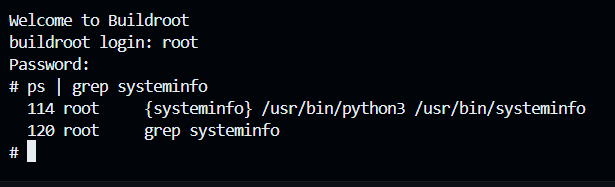
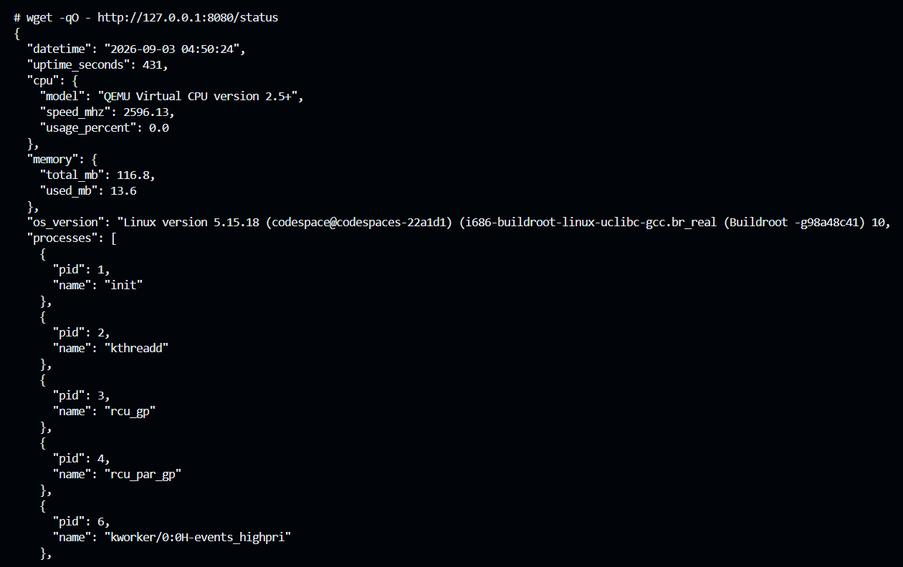
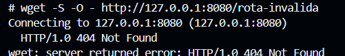

# SystemInfo — Servidor HTTP para exportação de informações do sistema

Trabalho Prático — Laboratório de Sistemas Operacionais

## 1. Descrição do funcionamento

`systeminfo` é uma aplicação em Python 3 (apenas Python Standard Library) que
roda dentro de uma imagem Linux embarcada gerada com **Buildroot** e é
executada **automaticamente no boot** do sistema.

Ao subir, o programa inicia um servidor HTTP simples (baseado em
`http.server.HTTPServer`) escutando na porta **8080** de todas as interfaces
(`0.0.0.0`). O único endpoint exposto é:

```
GET /status
```

Cada requisição a `/status` dispara, em tempo real, a leitura de arquivos em
`/proc` e `/sys` e devolve um JSON com o estado atual do sistema — nada é
armazenado em cache ou lido apenas uma vez no início; toda informação é
recalculada a cada chamada.

Qualquer outro caminho retorna `404 Not Found`.

### Exemplo de requisição

A partir de outra máquina (ex.: o seu computador, fora da VM), com `curl`:

```bash
curl http://<ip-da-vm>:8080/status
```

> Se o teste for feito **de dentro da própria VM** (via console do QEMU),
> use `wget` no lugar de `curl` — a imagem gerada pelo Buildroot inclui
> apenas o `wget` do BusyBox:
> ```sh
> wget -qO - http://127.0.0.1:8080/status
> ```

### Exemplo de resposta

```json
{
  "datetime": "2026-09-03 14:33:10",
  "uptime_seconds": 123456,
  "cpu": {
    "model": "ARMv7 Processor rev 4 (v7l)",
    "speed_mhz": 1200,
    "usage_percent": 17.5
  },
  "memory": {
    "total_mb": 512,
    "used_mb": 230
  },
  "os_version": "Linux version 5.15.18 (buildroot@host) #1 SMP ...",
  "processes": [
    { "pid": 1, "name": "init" },
    { "pid": 2, "name": "kthreadd" }
  ],
  "disks": [
    { "device": "/dev/sda", "size_mb": 8192 }
  ],
  "usb_devices": [
    { "port": "1-1", "description": "SanDisk Corp. Cruzer Blade" }
  ],
  "network_adapters": [
    { "interface": "eth0", "ip_address": "192.168.1.10" }
  ]
}
```

## 2. Como o serviço é integrado à imagem Buildroot

- **Código-fonte:** `custom-scripts/systeminfo` (script Python executável,
  copiado para `/usr/bin/systeminfo` no rootfs).
- **Inicialização automática:** `custom-scripts/S99systeminfo`, um script de
  init estilo SysV/BusyBox copiado para `/etc/init.d/S99systeminfo`, que
  inicia o processo via `start-stop-daemon` durante o boot (runlevel padrão)
  e permite `start` / `stop` / `restart`.
- **Cópia para o rootfs:** feita por `custom-scripts/pre-build.sh`, registrado
  como `BR2_ROOTFS_POST_BUILD_SCRIPT` no `.config`. Esse script roda ao final
  do build do Buildroot e copia `systeminfo` e `S99systeminfo` para dentro do
  diretório de destino (`$BASE_DIR/target`) antes da imagem final ser gerada.
- **Dependências habilitadas no `.config`:** `BR2_PACKAGE_PYTHON3=y`
  (nenhuma biblioteca externa é necessária, pois o script usa apenas
  `json`, `os`, `time` e `http.server`, todos da Standard Library).

## 3. De onde vem cada informação (mapeamento `/proc` e `/sys`)

| Campo no JSON | Fonte | Como é obtido |
|---|---|---|
| `datetime` | `/proc/stat` (campo `btime`) + `/proc/uptime` | `btime` é o horário (epoch) do boot; somando o uptime atual chega-se ao horário corrente do sistema, formatado como `YYYY-MM-DD HH:MM:SS`. |
| `uptime_seconds` | `/proc/uptime` | Primeiro campo do arquivo é o tempo em segundos desde o boot (parte fracionária é descartada). |
| `cpu.model` | `/proc/cpuinfo` | Linha `model name` (fallback para `unknown` se não existir, comum em algumas arquiteturas). |
| `cpu.speed_mhz` | `/proc/cpuinfo` (linha `cpu MHz`) | Se ausente, usa fallback lendo `cpuinfo_max_freq` em `/sys/devices/system/cpu/cpu0/cpufreq/` (valor em kHz, convertido para MHz). |
| `cpu.usage_percent` | `/proc/stat` (linha `cpu `) | Calculado comparando os contadores de jiffies (`total` e `idle+iowait`) em dois instantes separados por 200 ms, obtendo o percentual de uso no intervalo. |
| `memory.total_mb` / `memory.used_mb` | `/proc/meminfo` | `MemTotal` para o total; memória usada = total − disponível, onde disponível é `MemAvailable` (ou, se ausente, `MemFree + Buffers + Cached`). Valores convertidos de kB para MB. |
| `os_version` | `/proc/version` | Linha completa da versão do kernel; fallback para `/proc/sys/kernel/osrelease`. |
| `processes[].pid` / `.name` | `/proc/<pid>/comm` | Cada subdiretório numérico de `/proc` é um processo; o nome é lido de `comm` (ou, na ausência, extraído de `/proc/<pid>/stat` entre parênteses). Lista ordenada por PID. |
| `disks[].device` / `.size_mb` | `/sys/block/<dev>/size` | Cada entrada em `/sys/block` é um dispositivo de bloco; `size` contém o tamanho em setores de 512 bytes, convertido para MB. Dispositivos virtuais (`loop*`, `ram*`, `zram*`, `dm-*`, `md*`) são ignorados. |
| `usb_devices[].port` / `.description` | `/sys/bus/usb/devices` | Cada entrada sem `:` no nome e que possua o arquivo `idVendor` é um dispositivo USB real (as entradas com `:` são interfaces, não dispositivos). Descrição é montada a partir de `manufacturer` e `product`, com fallback para `idVendor:idProduct`. |
| `network_adapters[].interface` / `.ip_address` | `/sys/class/net` + `/proc/net/route` + `/proc/net/fib_trie` (IPv4) / `/proc/net/if_inet6` (IPv6) | As interfaces vêm de `/sys/class/net`. Os endereços IPv4 locais são extraídos de `/proc/net/fib_trie` (entradas `LOCAL`) e associados à interface certa cruzando com as rotas de `/proc/net/route` (rede/máscara em hexadecimal). Se não houver IPv4, tenta IPv6 via `/proc/net/if_inet6`. |

## 4. Como executar

1. Build da imagem:
   ```bash
   cd buildroot
   make
   ```
2. Rodar no QEMU (script já incluso no projeto):
   ```bash
   ./start-qemu.sh
   ```
3. Dentro da VM, verificar se o serviço subiu:
   ```bash
   ps | grep systeminfo
   ```
4. Testar o endpoint:
   - **De outra máquina/terminal** (host), conforme a rede configurada por
     `S41network-config` — requer `-net nic` no comando do QEMU (ver Passo 6
     do tutorial de testes):
     ```bash
     curl http://192.168.1.10:8080/status
     ```
   - **De dentro da própria VM** (mais simples, não depende de configuração
     de rede no host) — usando `wget`, já que `curl` não está incluído na
     imagem:
     ```sh
     wget -qO - http://127.0.0.1:8080/status
     ```

## 5. Capturas de tela

A imagem foi gerada com sucesso e o serviço foi validado rodando em QEMU
(`./start-qemu.sh`), com login `root` / senha `labsisop` (definida em
`BR2_TARGET_GENERIC_ROOT_PASSWD` no `.config`).

Todas as capturas abaixo estão na pasta [`screenshots/`](./screenshots).

### 5.1 Serviço iniciando automaticamente no boot

Trecho do log de boot mostrando o `dropbear` (SSH) e, principalmente, o
`systeminfo` subindo sozinho durante a inicialização, sem nenhuma
intervenção manual:


### 5.2 Processo em execução

Confirmação, via `ps`, de que o processo `systeminfo` (rodando o
`/usr/bin/python3 /usr/bin/systeminfo`) está de fato ativo:



### 5.3 Resposta do endpoint `/status`

Requisição feita com `wget -qO - http://127.0.0.1:8080/status`, mostrando o
JSON completo (dividido em várias capturas por conta do tamanho da saída no
terminal):




> `cpu.model` aparece como "QEMU Virtual CPU" porque a VM roda sob QEMU (não
> hardware real) — o valor vem direto de `/proc/cpuinfo`, exatamente como
> especificado. `usb_devices` aparece vazio pois a VM não tem nenhum
> dispositivo USB emulado, e `network_adapters` não lista `eth0` porque o
> `start-qemu.sh` não anexa nenhuma placa de rede virtual à VM (`-net nic`);
> `sit0` é a interface de túnel IPv6 padrão do kernel Linux, sempre presente
> mesmo sem hardware de rede.

### 5.4 Rota inexistente retorna 404

Requisição a uma rota que não existe (`/rota-invalida`), confirmando que o
servidor responde corretamente com `404 Not Found` para qualquer caminho
diferente de `/status`:

